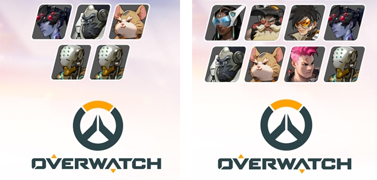
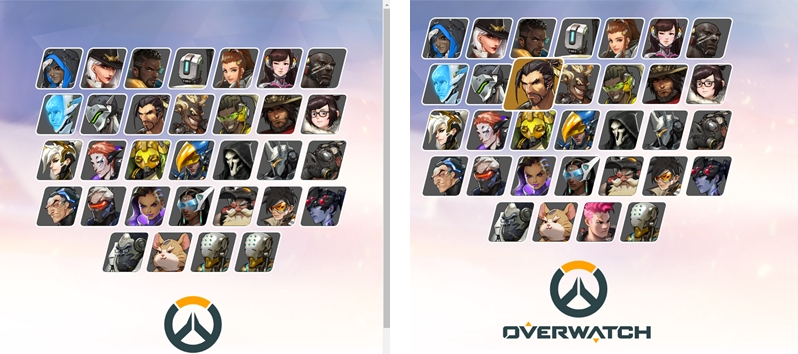

# overwatch clone
https://overwatch-clone.netlify.app/

### v1.0.0
>학습용 클론코딩  
html+css만으로 제작  
강사의 결과물과 최대한 똑같이 만들었습니다  

 

### v1.0.1 버그 수정과 디자인 개선
>모바일 세로화면에서 캐릭터가 한 줄에 최대 3개씩 → 4개씩 나옵니다  
로고 이미지가 오른쪽으로 쏠리는 현상이 수정되었습니다  
마지막에 젠야타가 2개였는데 1개를 자리야로 수정했습니다  
>
  
pc 전체화면에서 이제 스크롤바 없이 모든 요소가 온전히 출력됩니다  
>